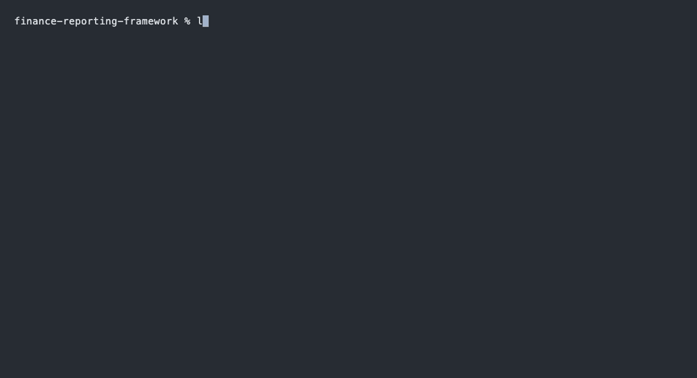
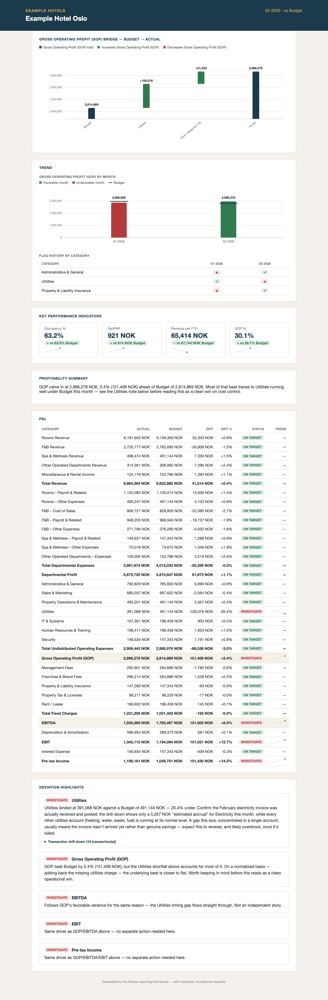
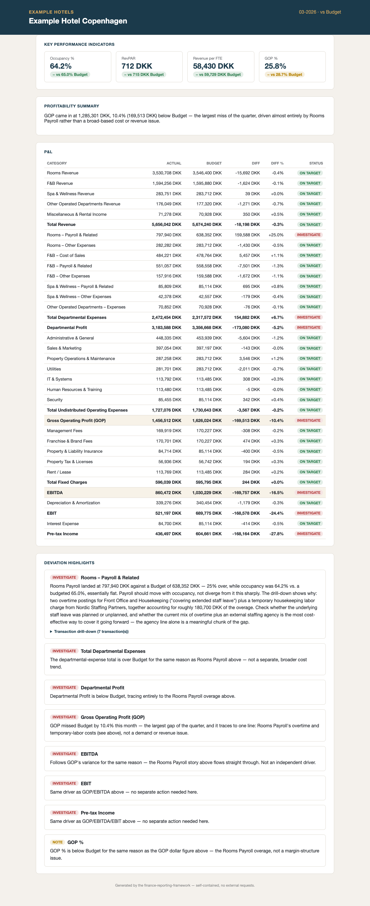
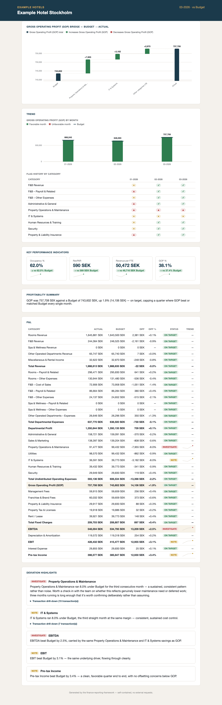

# finance-reporting-framework

[](https://github.com/echosmasher/finance-reporting-framework/actions/workflows/ci.yml)

**Monthly management reporting takes controllers days of manual work.
This framework compresses it to an upload-and-review loop: deterministic
Python computes the numbers, Claude interprets them using *your*
company's thresholds, terminology, and institutional knowledge —
captured once during setup.**

## The loop

Validate → preprocess → flag deviations against threshold → render a
dashboard — the same deterministic pipeline `/analysis` and `/dashboard`
run in Claude Code, shown here as its own underlying scripts so the
mechanism is visible, not just the slash commands:



## Screenshots

| Catching a real problem | Catching a different real problem | Correctly not manufacturing one |
|---|---|---|
|  |  |  |
| Example Hotel Oslo, Feb 2026 | Example Hotel Copenhagen, Mar 2026 | Example Hotel Stockholm, Mar 2026 |

**Live demo:** [echosmasher.github.io/finance-reporting-framework](https://echosmasher.github.io/finance-reporting-framework/)
Or skip straight to the committed HTML — see Quickstart below, no
deployment needed to look around.

## The problem

A controller closing the month spends days pulling GL exports,
reconciling them against budget, figuring out which of a hundred small
variances actually matter, and writing it all up in language a GM or a
board will actually read — every month, for every property, mostly by
hand. The analysis itself isn't hard for an experienced controller; it's
just slow, and the tacit knowledge behind it ("a low Utilities number
usually means a missing invoice, not real savings") lives in their head,
not anywhere a spreadsheet can apply it automatically.

This framework doesn't try to replace that judgment — it captures it
once, in `/setup`, and then applies it automatically every month: the
same threshold logic, the same investigation instincts, the same
company-specific tone, running against whatever GL export gets dropped
in `inbox/`.

## How it works

```
                    /setup   (once, re-runnable)
                       │
                       ▼
                   config/   ← entities, P&L structure, thresholds,
                               investigation heuristics, KPIs, brand
                       │
     ┌─────────────────────────────────────────────┐
     │                monthly loop                  │
     │                                               │
     │   ERP export → inbox/ → /analysis → /dashboard│
     │                            │            │      │
     │                    analyst report   branded    │
     │                    (the numbers)   dashboard    │
     │                                   (the audience)│
     └─────────────────────────────────────────────┘
                                             │
                                             ▼
                                        /feedback  (reviewer comments,
                                                     narrative edits —
                                                     re-renders /dashboard)
                                             │
                                             ▼
                  distribute (file, email, or a URL —
                  see docs/DEPLOYMENT.md)
```

`/analysis` is itself a fixed pipeline, not a black box: validate → 
normalize → deterministically flag every deviation against threshold →
*then* an LLM narrative pass explains the flagged items, using the
company's own investigation checklists. See **Architecture** below for
why that split matters.

After `/dashboard` renders, `/feedback` lets whoever's reviewing it talk
to Claude Code in plain language and have the dashboard reflect it — no
hand-edited JSON, no separate redeploy step:

- *"Add a comment to Sales & Marketing: we received a delayed invoice
  from Acme Media."* — pins a note to that row or KPI, attributed and
  dated, visually distinct from the LLM-written narrative.
- *"Remove the note on F&B revenue."* — suppresses the generated
  narrative for a flagged item. The flag and its status pill stay
  visible either way; only the prose explanation is hidden.

It refuses anything that isn't a comment or a narrative edit — asking to
change a status or a number gets redirected to `/setup` (adjust a
threshold) or `/analysis` (fix bad input data), never quietly honored,
since a comment can't override a number `analyze.py` already computed
(`CLAUDE.md`'s Python-computes/Claude-interprets split). Feedback is
stored in `feedback/feedback_{ENTITY}_{PERIOD}.json` — human-authored,
same category as `config/`, survives an `outputs/` wipe — via
`skills/feedback/scripts/feedback_store.py`, then `/dashboard`
re-renders automatically. Full behavior in `skills/feedback/SKILL.md`;
`examples/example-hotels/feedback/feedback_002_02-2026.json` is a real
committed before/after (Example Hotel Bergen's February dashboard).

## Quickstart: the demo

No setup needed — every output below is already generated and
committed.

```bash
git clone https://github.com/echosmasher/finance-reporting-framework.git
cd finance-reporting-framework
open examples/example-hotels/outputs/001-Dashboard_02-2026.html
```

That's Example Hotel Oslo's February dashboard — the missing-electricity-invoice
story from the screenshots above. The full set is in
`examples/example-hotels/outputs/`: 4 entities × 3 months × 5 file types
(dashboards, analyst reports, and the underlying JSON/CSV). See
`examples/example-hotels/README.md` for all four planted stories and the
exact numbers that prove the analysis caught them.

To regenerate everything from scratch (or re-run the pipeline yourself
against the same demo data), open this repo in Claude Code and run:

```
/analysis for 001 02-2026
/dashboard for 001 02-2026
```

(`examples/example-hotels/generate_demo_data.py` produces the synthetic
input data itself, if you want to regenerate that too — it's seeded, so
output is reproducible.)

## Quickstart: your own company

```
/setup
```

run inside Claude Code, in a clone of this repo. It's a conversational
interview — company & entities, audience & tone, P&L structure, sample
data, thresholds, investigation heuristics, KPIs, branding — that builds
`config/` section by section, confirming its understanding before
writing anything. See `skills/setup/SKILL.md` for the full interview,
and `docs/DATA_REQUIREMENTS.md` for what to have ready before you start.

Once `config/` exists, the monthly loop is `docs/HANDBOOK.md`.

## Architecture

```
config/                          ← everything company-specific lives here
├── company-profile.md             audience, tone, focus, seasonality
├── entities.csv                   which properties, what currency
├── pnl-structure.yaml             category cascade, subtotal formulas
├── account-mapping.csv            GL account → P&L category
├── thresholds.yaml                materiality, per-category overrides
├── investigation-guide.md         the controller's own HIGH/LOW checklists
├── kpi-definitions.yaml           which KPIs, how they're computed
├── data-dictionary.md             file conventions (delimiter, sign, etc.)
└── brand.md                       dashboard design tokens

skills/
├── setup/       → interview that produces config/
├── analysis/    → validate → preprocess → analyze → narrate
├── dashboard/   → render config/'s brand tokens + analysis into HTML
└── feedback/    → reviewer comments + narrative edits, re-renders the dashboard
```

**The non-negotiable principle**: `skills/` and `scripts/` are generic
engines — nothing in them ever hardcodes a company-specific value.
Everything that varies by company lives in `config/`. This was tested
directly, not just claimed: `tasks.md` documents five separate points
where engine code was found hardcoding a demo-specific assumption
(a KPI name, a subtotal name, a file-format convention) instead of
reading it from `config/` — each one caught and fixed, several by
literally re-encoding the demo's real financial data in a different
file format and proving the *exact same* unmodified scripts still
produced identical output.

**Python computes, Claude interprets.** Every number — every P&L
actual, every variance, every threshold breach — comes from
deterministic, tested Python (`skills/analysis/scripts/*.py`,
`tests/`). An LLM never computes a number, only writes prose about
numbers Python already computed. See `docs/LESSONS_LEARNED.md` for why
this split exists and where it gets genuinely subtle (a narrative pass
still has to *recognize* that a favorable-looking variance might not be
good news — that's judgment the split deliberately leaves to the LLM,
just never the arithmetic underneath it).

## Deployment

Dashboards are single, self-contained HTML files — inline CSS, inline
data, zero external requests. Three tiers, in order of infrastructure
needed: **file-based** (email or a shared drive — the default, zero
setup), **Google Apps Script web app** (a stable URL for a Google
Workspace company — static serving only, see the caveat in
`docs/LESSONS_LEARNED.md`), and **static hosting** (GitHub Pages or an
internal server — never a public host for real financials). Full
walkthrough: `docs/DEPLOYMENT.md`.

## Roadmap

`ROADMAP.md` — feedback/correction workflows, YTD and trend views,
cross-entity consolidation, multi-currency, balance sheet/cash flow,
an automated inbox watcher, localization packs, and a fully
industry-agnostic operational-data schema are all explicitly out of
scope for v1, not overlooked.

## License

MIT — see `LICENSE`.
